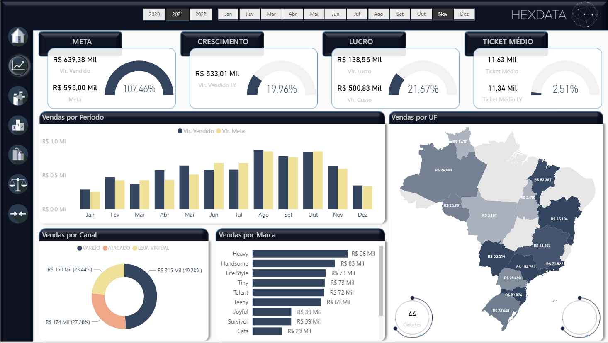

# BI & Data Analytics Portfolio

Portfólio com 4 projetos de Business Intelligence aplicados a áreas críticas do negócio:
**Comercial, Logística, Controle de Produção e DRE (Financeiro)**.

> Projetos demonstrativos: sem dados sensíveis.

---

## Projetos

### 01) Comercial
**Objetivo:** acompanhamento de vendas, margem, mix e performance comercial.  
➡️ Relatório (Power BI): COLE_AQUI_O_LINK  
📄 Documentação: [ver projeto](projects/01-comercial/README.md)

---

### 02) Logística
**Objetivo:** indicadores de entregas, prazos, OTIF, custos e eficiência operacional.  
➡️ Relatório (Power BI): COLE_AQUI_O_LINK  
📄 Documentação: [ver projeto](projects/02-logistica/README.md)

---

### 03) Controle de Produção
**Objetivo:** produtividade, eficiência, paradas, perdas e capacidade.  
➡️ Relatório (Power BI): COLE_AQUI_O_LINK  
📄 Documentação: [ver projeto](projects/03-controle-producao/README.md)

---

### 04) DRE (Financeiro)
**Objetivo:** visão executiva de receita, custos, despesas, EBITDA e resultado.  
➡️ Relatório (Power BI): COLE_AQUI_O_LINK  
📄 Documentação: [ver projeto](projects/04-dre/README.md)

---

## Stack / Competências
- Power BI (modelagem, DAX, performance)
- SQL (extração e tratamento)
- Spark / PySpark (processamento quando aplicável)
- Modelagem Dimensional e boas práticas de DW
